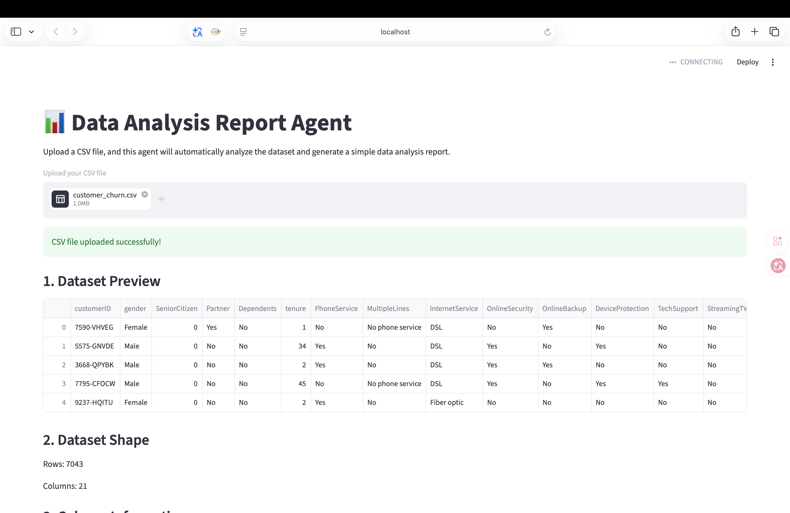
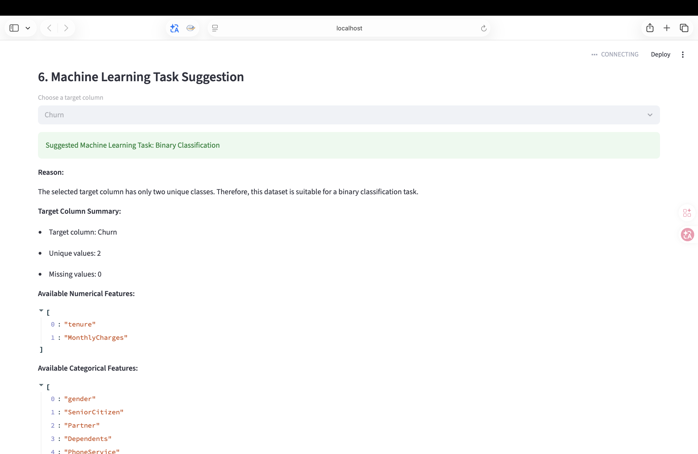
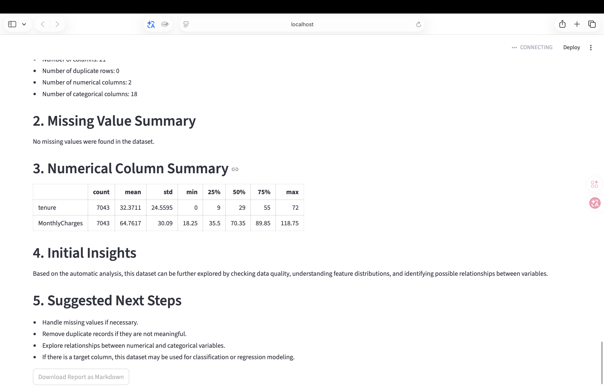

# Data Analysis Report Agent

A Streamlit-based data analysis assistant that automatically analyzes uploaded CSV datasets,
detects data quality issues, generates visualizations, suggests suitable machine learning
tasks, creates a downloadable Markdown report, and can optionally generate AI-assisted
insights using OpenAI or Gemini with a compact dataset summary.

## Live Demo

[Open the Streamlit App](https://data-analysis-report-agent.streamlit.app)

## Project Overview

Data Analysis Report Agent is designed to help users quickly understand a dataset without
manually writing repeated exploratory data analysis code.

Users can upload a CSV file, and the application will automatically generate dataset
summaries, missing value checks, duplicate row checks, descriptive statistics,
visualizations, and machine learning task suggestions.

This project demonstrates practical skills in Python, data analysis automation, Streamlit
web development, and basic AI-agent-style workflow design.

## Demo Screenshots

### Dataset Overview



### Machine Learning Task Suggestion



### Generated Report



## Features

* Upload CSV files through a web interface
* Preview dataset records
* Display dataset shape and column information
* Explain the agent-style workflow with tool-like analysis steps
* Check missing values and duplicate rows
* Calculate a data quality score
* Give automatic data cleaning suggestions
* Automatically detect numerical, categorical, and ID-like columns
* Exclude ID-like columns from unsuitable visualizations
* Treat binary numerical columns as categorical features
* Generate numerical column visualizations
* Generate categorical column visualizations
* Show correlation analysis for suitable numerical columns
* Optionally generate AI-assisted insights with OpenAI or Gemini
* Use multi-provider LLM fallback from OpenAI to Gemini
* Suggest suitable machine learning task types:

  * Regression
  * Binary classification
  * Multi-class classification
* Recommend suitable machine learning models and evaluation metrics
* Generate and download an improved Markdown data analysis report

## Tech Stack

* Python
* Streamlit
* pandas
* matplotlib
* tabulate
* OpenAI API
* Gemini API
* python-dotenv

## Agent Workflow

The app follows a tool-based analysis workflow. Each step processes the dataset and passes
useful information to the next step, similar to how an AI data analyst agent would work.

The workflow includes:

* CSV Reader
* Data Type Converter
* Column Type Detector
* Data Quality Scorer
* Correlation Analyzer
* ML Task Recommender
* LLM Insight Generator
* Markdown Report Generator

## Project Structure

```text
data-analysis-report-agent/
├── app.py
├── requirements.txt
├── CHANGELOG.md
├── README.md
├── .gitignore
└── assets/
    └── screenshots/
```

## How to Run the Project

### 1. Clone the repository

```bash
git clone https://github.com/Lovis-Ghost/data-analysis-report-agent.git
cd data-analysis-report-agent
```

### 2. Create a virtual environment

```bash
python3 -m venv venv
source venv/bin/activate
```

### 3. Install dependencies

```bash
pip install -r requirements.txt
```

### 4. Optional: enable AI insights

Create a `.env` file or set environment variables named `OPENAI_API_KEY` and
`GEMINI_API_KEY`. If no API key is available, the app still runs normally with the
rule-based analysis.

```bash
OPENAI_API_KEY=your_openai_api_key_here
GEMINI_API_KEY=your_gemini_api_key_here
```

The AI Insight Generator tries OpenAI first and can fall back to Gemini if OpenAI has a
quota, billing, or API issue. It sends only compact summary information, such as column
details, summary statistics, data quality notes, and machine learning suggestions. It does
not send the full dataset.

### 5. Run the Streamlit app

```bash
streamlit run app.py
```

## Example Use Case

For a customer churn dataset, the agent can automatically detect that the target column
`Churn` is suitable for a binary classification task.

It then suggests possible models such as:

* Logistic Regression
* Decision Tree
* Random Forest
* XGBoost Classifier

It also recommends suitable evaluation metrics such as:

* Accuracy
* Precision
* Recall
* F1-score
* ROC-AUC

## Current Version

### V1.6 - Agent Workflow Explanation

The current version supports automatic dataset analysis, smart column detection, data
quality assessment, correlation analysis, machine learning task suggestion, an improved
Markdown report, optional AI-generated insights with OpenAI or Gemini fallback, and an
agent workflow explanation that shows the tool-style analysis process.

## Future Improvements

* Add model training for baseline classification and regression models
* Add PDF or Word report export

## Author

Chen Hongyu  
Master of Artificial Intelligence  
Universiti Kebangsaan Malaysia
