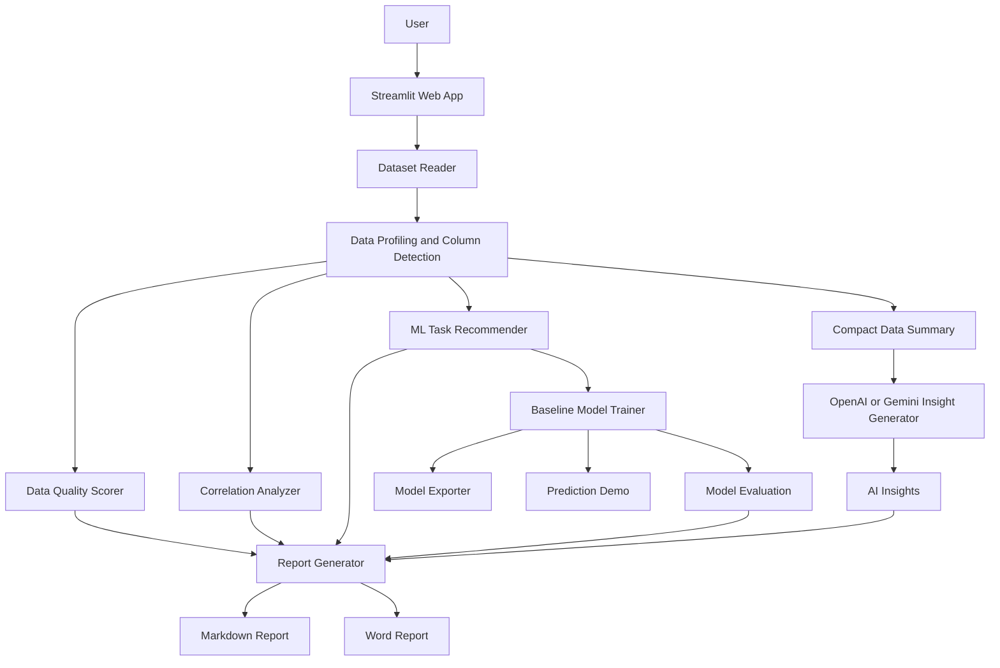
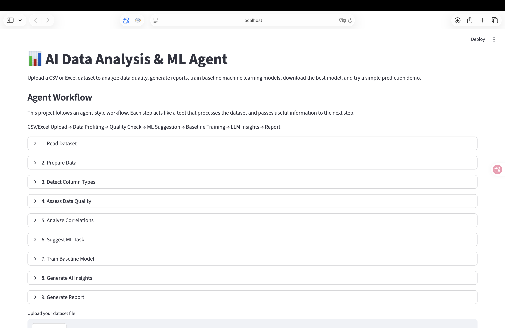
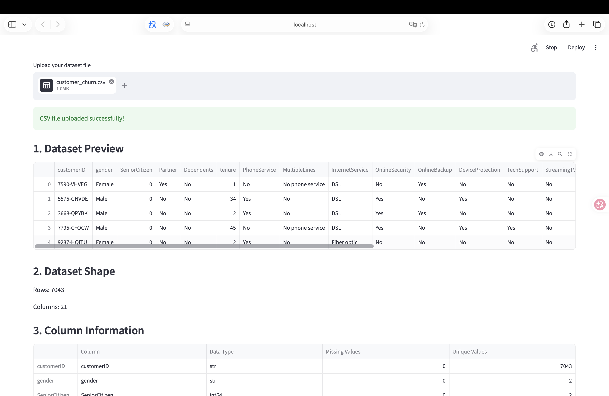
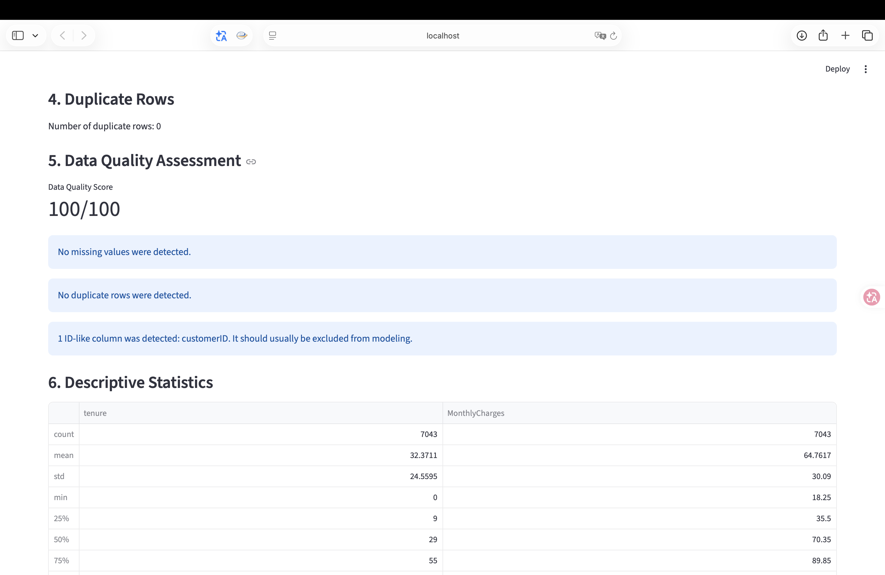
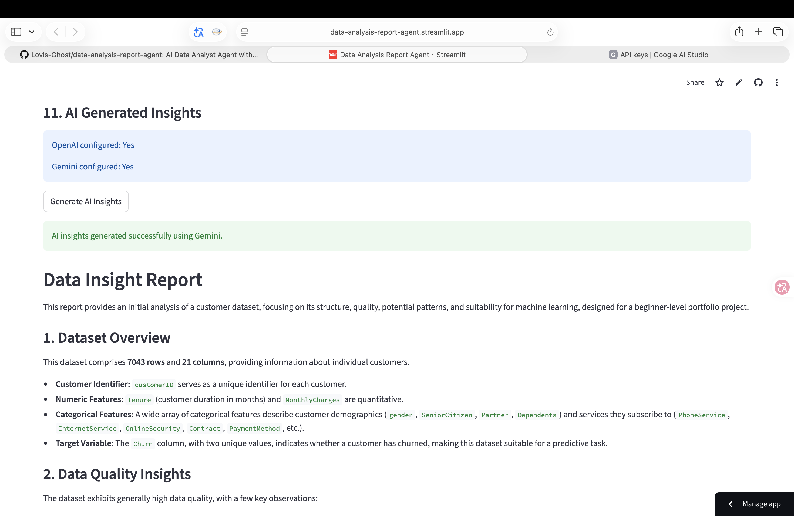
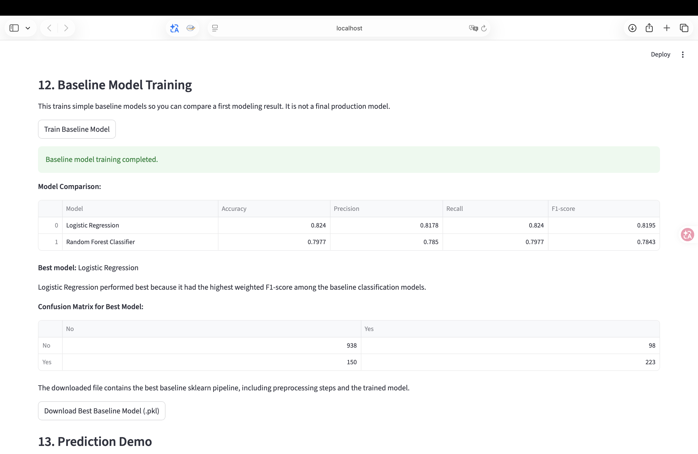
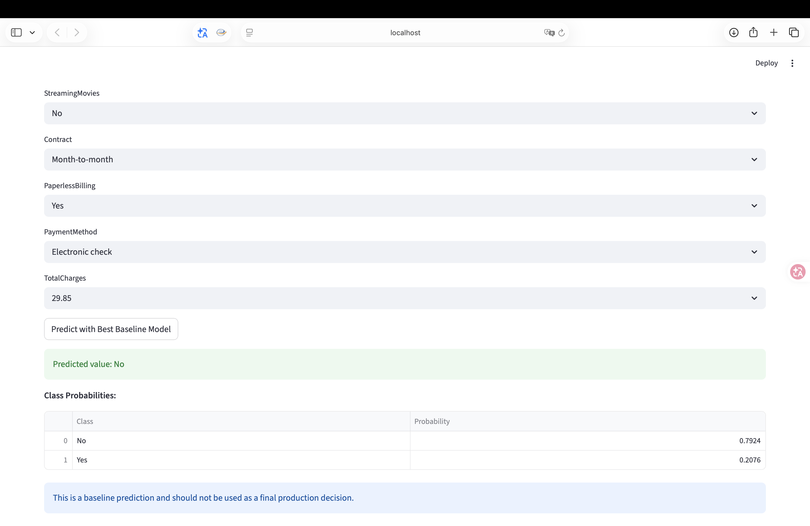
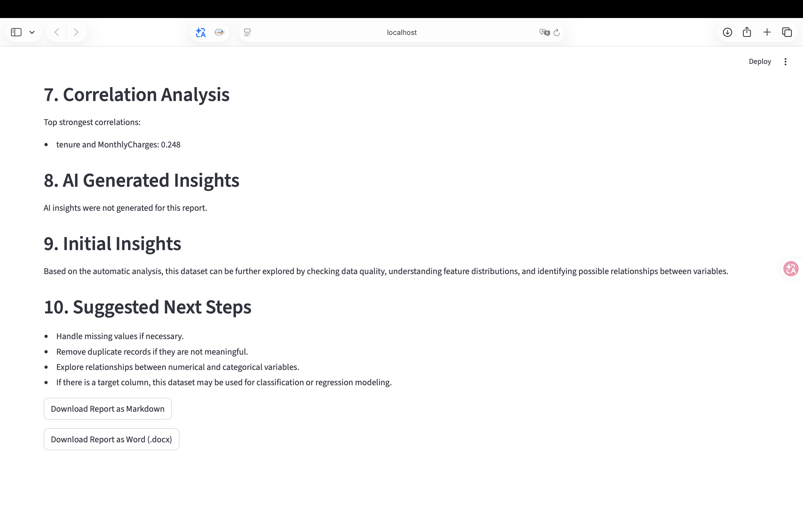

# AI Data Analysis & ML Agent

An end-to-end Streamlit application for CSV and Excel dataset analysis, data quality checking, AI-assisted insight generation, baseline machine learning training, model download, prediction demo, and Markdown report generation.

## Live Demo

[Open the Streamlit App](https://ai-data-analysis-ml-agent.streamlit.app)

## Project Overview

**AI Data Analysis & ML Agent** helps users quickly understand a dataset and complete a first-pass machine learning workflow without manually writing repeated exploratory data analysis code.

Users can upload a CSV or Excel file and the app will automatically generate dataset summaries, data quality checks, visualizations, machine learning task suggestions, baseline model training results, a downloadable model, a prediction demo, and a structured Markdown report.

This project is designed as a portfolio project for AI Agent, Machine Learning, Data Analyst, and Data Science internship applications.

## End-to-End Workflow

```text
Upload CSV or Excel dataset
→ Profile dataset
→ Check data quality
→ Suggest machine learning task
→ Train baseline models
→ Compare model metrics
→ Download the best model
→ Try a single-sample prediction
→ Generate a Markdown report
```

## System Architecture



## Demo Screenshots

### Agent Workflow



### Dataset Upload and Preview



### Data Quality Assessment



### AI-Assisted Insights



### Baseline Model Training and Model Download



### Prediction Demo



### Report Download



## Key Features

### Data Analysis

- Upload CSV or Excel `.xlsx` datasets
- Select a specific Excel sheet for analysis
- Preview dataset records
- Display dataset shape and column information
- Automatically detect numerical, categorical, and ID-like columns
- Check missing values and duplicate rows
- Calculate a data quality score
- Generate beginner-friendly data cleaning suggestions
- Create numerical and categorical visualizations
- Show correlation analysis for suitable numerical columns

### AI-Assisted Insights

- Generate optional AI-assisted insights using OpenAI or Gemini
- Use fallback from OpenAI to Gemini when available
- Send only compact summary information instead of the full dataset
- Add AI-generated insights to the Markdown report when generated

### Machine Learning

- Choose a target column
- Automatically suggest a suitable machine learning task type
- Support regression, binary classification, and multi-class classification suggestions
- Train baseline classification and regression models
- Compare evaluation metrics across baseline models
- Show confusion matrix for classification tasks
- Select the best baseline model automatically

### Model Download and Prediction Demo

- Download the best trained baseline model as a `.pkl` file
- Save preprocessing steps and the trained model together as an sklearn Pipeline
- Enter a new sample and generate a prediction using the best baseline model
- Display class probabilities when the classification model supports probability prediction

### Report Generation

- Generate and download a Markdown report
- Generate and download a Word `.docx` report
- Generate and download a PDF report
- Include dataset overview, missing value summary, data quality assessment, machine learning task suggestion, model training results, AI insights, and suggested next steps

## Agent Workflow

The app follows a tool-based agent workflow. Each component processes part of the dataset and passes useful information to the next step.

| Step | Component | Output |
|---|---|---|
| 1 | Dataset Reader | Loaded CSV or Excel dataset |
| 2 | Data Type Converter | Prepared dataframe |
| 3 | Column Type Detector | Numerical, categorical, and ID-like columns |
| 4 | Data Quality Scorer | Quality score and cleaning suggestions |
| 5 | Correlation Analyzer | Correlation summary |
| 6 | ML Task Recommender | Suggested task type, models, and metrics |
| 7 | Baseline Model Trainer | Model comparison and best baseline model |
| 8 | Model Exporter | Downloadable sklearn Pipeline package |
| 9 | Prediction Demo | Single-sample prediction and probabilities |
| 10 | LLM Insight Generator | Optional AI-generated insights |
| 11 | Report Generator | Final downloadable Markdown, Word, and PDF reports |

## Portfolio Highlights

| Skill Area | Evidence in This Project |
|---|---|
| Python | Uses pandas, NumPy, matplotlib, scikit-learn, and joblib |
| Data Analysis | Automates profiling, missing value checks, duplicate checks, and summaries |
| Machine Learning | Builds baseline classification and regression pipelines |
| Model Evaluation | Compares classification and regression metrics |
| ML Engineering | Saves preprocessing and model steps together as a reusable Pipeline |
| AI Agent Design | Organizes analysis into a step-by-step tool-style workflow |
| LLM Integration | Supports optional OpenAI and Gemini insights |
| Web App Development | Provides an interactive Streamlit interface and live deployment |
| Reporting | Generates downloadable Markdown, Word, and PDF reports |

## Tech Stack

- Python
- Streamlit
- pandas
- NumPy
- matplotlib
- scikit-learn
- joblib
- tabulate
- OpenAI API
- Gemini API
- python-dotenv
- openpyxl
- python-docx
- ReportLab

## Example Files

- `examples/sample_churn.csv` can be used to test the full workflow.
- `examples/example_markdown_report.md` shows an example generated report.
- `examples/example_prediction_result.md` shows an example prediction output.
- `examples/README.md` provides detailed demo testing steps.

## How to Use the App

1. Open the Streamlit demo.
2. Upload a CSV or Excel dataset.
3. Review the dataset preview, column information, and data quality results.
4. Select a target column for machine learning task suggestion.
5. Train baseline models and compare evaluation metrics.
6. Download the best trained baseline model if needed.
7. Use the prediction demo to test one new sample.
8. Download the generated Markdown, Word, or PDF report.

## Example Use Case

For a customer churn dataset, the app can detect that the target column `Churn` is suitable for binary classification.

It can then train baseline models, compare evaluation metrics, show a confusion matrix, export the best trained pipeline, predict whether a new customer is likely to churn, and generate Markdown, Word, or PDF reports summarizing the analysis.

## Project Structure

```text
ai-data-analysis-ml-agent/
├── app.py
├── requirements.txt
├── CHANGELOG.md
├── README.md
├── .gitignore
├── docs/
│   └── technical_design.md
├── examples/
│   ├── README.md
│   ├── sample_churn.csv
│   ├── example_markdown_report.md
│   └── example_prediction_result.md
├── modules/
│   ├── __init__.py
│   ├── workflow.py
│   ├── data_loader.py
│   ├── column_detection.py
│   ├── data_quality.py
│   ├── correlation.py
│   ├── ai_insights.py
│   ├── ml_task.py
│   ├── ml_trainer.py
│   ├── prediction.py
│   ├── report_export.py
│   └── report_generator.py
└── assets/
    └── screenshots/
```

## How to Run Locally

### 1. Clone the repository

```bash
git clone https://github.com/Lovis-Ghost/ai-data-analysis-ml-agent.git
cd ai-data-analysis-ml-agent
```

### 2. Create and activate a virtual environment

```bash
python3 -m venv venv
source venv/bin/activate
```

### 3. Install dependencies

```bash
pip install -r requirements.txt
```

### 4. Optional AI insights

AI insights are optional. Add OpenAI or Gemini credentials through environment variables or Streamlit secrets if you want to enable the AI Insight Generator.

If no credentials are provided, the app still works normally with rule-based analysis, baseline model training, model download, prediction demo, and Markdown report generation.

### 5. Run the app

```bash
streamlit run app.py
```

## Technical Documentation

`docs/technical_design.md` explains the system design, module responsibilities, data flow, machine learning workflow, report export workflow, and LLM insight workflow.

## Current Version

### V2.6A - Public Portfolio Polish

The current version supports automatic dataset analysis, smart column detection, data quality assessment, correlation analysis, machine learning task suggestion, baseline classification and regression model training, model download for the best baseline sklearn Pipeline, a prediction demo using the trained baseline Pipeline, an improved Markdown report, optional AI-generated insights with OpenAI or Gemini fallback, and CSV or Excel uploads.

The project now includes public technical design documentation and keeps interview and resume preparation materials outside the public repository.

## Future Improvements

- Add advanced model tuning
- Add SHAP-based model explanation
- Keep screenshots updated when the UI changes

## Resume-Ready Project Summary

**AI Data Analysis & ML Agent** — Built an end-to-end Streamlit application that automates dataset profiling, data quality assessment, AI-assisted insight generation, baseline machine learning training, model evaluation, model download, single-sample prediction, and Markdown/Word/PDF report generation for CSV and Excel datasets.

## Author

Chen Hongyu  
Master of Artificial Intelligence  
Universiti Kebangsaan Malaysia
